## Structured Notes: Introduction to Artificial Intelligence (CSE 4617)

**Core Idea:**
Artificial Intelligence (AI) is the science and engineering of making intelligent machines—especially computer programs—that can perform tasks typically requiring human intelligence, such as reasoning, learning, perception, and problem-solving[^1_1][^1_2][^1_3].

## 1. Course Logistics (CSE 4617)

- **Lecturer:** Isham Tashdeed
- **Communication:** Google Classroom, Email
- **Textbooks:**
    - Russell \& Norvig, *Artificial Intelligence: A Modern Approach* (4th Ed.)
    - Sutton \& Barto, *Reinforcement Learning: An Introduction* (2nd Ed.)
- **Grading:**
    - Attendance: 10%
    - Quiz: 15%
    - Mid-Semester: 25%
    - Semester Final: 50%
- **Academic Integrity:** No plagiarism—submit only your own work[^1_2].


## 2. AI in Popular Media

- **Movies \& Series:**
    - *Her*, *WALL-E*, *Westworld*, and works by Isaac Asimov (e.g., *I, Robot*, *The Foundation Series*) showcase AI’s impact on society and imagination[^1_2][^1_4].
- **Themes:**
    - AI as companions, helpers, or threats; explores ethical, philosophical, and societal implications.


## 3. AI in the Real World

**Examples of AI Applications:**

- **Image Generation:** AI creates digital art, raising debates about creativity vs. computation.
- **Text Generation:** AI writes emails, summarizes texts, and even generates news articles.
- **Economy:** AI influences stock markets, creates new financial instruments (like memecoins), and boosts company performance.
- **Politics:** Governments invest heavily in AI (e.g., EU, US, China) for economic growth and defense.
- **Research:** AI accelerates scientific discovery (e.g., AlphaFold for protein folding) but can introduce new errors and biases[^1_2].


## 4. Key Concepts \& Philosophical Questions

- **Definition (John McCarthy):**
AI is “the science and engineering of making intelligent machines, especially intelligent computer programs”[^1_1][^1_4].
- **Philosophical Question:**
Can a machine think and behave like a human?
- **Turing Test:**
A computer is considered intelligent if its responses are indistinguishable from a human’s[^1_2][^1_3].
- **AI vs. Human Intelligence:**
    - Humans: Smart, slow, sometimes inaccurate
    - Machines: Fast, accurate, but lack general understanding[^1_4]


## 5. History of AI: Major Milestones

| Year | Milestone/Event |
| :-- | :-- |
| 1950 | Alan Turing publishes "Computing Machinery and Intelligence" (Turing Test) |
| 1951 | SNARC: First neural-net machine by Marvin Minsky |
| 1952 | Samuel’s Checkers program (self-learning) |
| 1956 | Dartmouth Conference: AI as a field (John McCarthy coins "AI") |
| 1958 | LISP: First AI programming language |
| 1965 | Robinson’s algorithm for logical reasoning |
| 1969 | Minsky’s critique in "Perceptron" |
| 1970s | First "AI Winter" (funding cuts) |
| 1980s | Rise of Expert Systems, followed by another AI Winter |
| 1997 | IBM Deep Blue defeats chess champion Garry Kasparov |
| 2000s | Big data, big compute, neural networks resurgence |
| 2010s | AI in speech recognition, self-driving cars, AlphaGo, virtual assistants (Siri, Alexa, Cortana) |
| 2020s | AI deeply integrated in research, economy, politics, and daily life[^1_2][^1_4] |

## 6. Why AI Now? (Recent Growth Factors)

- **Advances in Computing Power:** Faster processors and GPUs.
- **Availability of Big Data:** Massive datasets for training.
- **Cloud and Fast Internet:** Enables large-scale AI model training.
- **Major Investments:** Tech giants (Google, Microsoft, Meta) drive innovation[^1_4].


## 7. Goals and Applications of AI

**Goals:**

- Create expert systems that demonstrate, explain, and advise[^1_1][^1_5].
- Implement human-like intelligence in machines (understand, learn, behave).
- Solve knowledge-intensive tasks (e.g., theorem proving, chess, surgery, self-driving cars)[^1_5].
- Enable systems to learn new things, adapt, and improve.

**Applications:**

- Problem solving, search, control strategies
- Speech and image recognition
- Natural language understanding
- Computer vision
- Expert systems[^1_6][^1_5]


## 8. Challenges and Limitations

- **AI Winters:** Periods of reduced funding and interest due to unmet expectations.
- **Current Limitations:** AI struggles with generalization, common sense, and tasks outside narrow domains.
- **Risks:** Bias, errors in scientific research, ethical concerns, and existential risks (p(doom): probability of catastrophic outcomes)[^1_2].


## 9. Thought-Provoking Quotes

> “By far the greatest danger of Artificial Intelligence is that people conclude too early that they understand it.”
> — Eliezer Yudkowsky[^1_2]

> “The development of full artificial intelligence could spell the end of the human race.”
> — Stephen Hawking[^1_2]

## 10. Example Scenarios

- **Image Generation:**
Imagine you ask a computer to draw a painting. It produces a beautiful image, but some argue it lacks “true” creativity because it doesn’t “feel” inspiration.
- **Text Generation:**
You need to write a long email. An AI tool expands your bullet points into a full message, saving you time, but can it truly understand the context or emotion?
- **AlphaFold in Research:**
Scientists use AI to predict protein structures, accelerating drug discovery. However, AI sometimes “hallucinates” results, leading to false discoveries.


## 11. Additional Resources

- *Will AI kill everyone? Here's what the godfathers of AI have to say*
- *Intro to AI Safety*
- *Computing Machinery and Intelligence* by A.M. Turing[^1_2]

**Summary:**
AI is a rapidly evolving field that sits at the intersection of computer science, philosophy, engineering, and society. It aims to create machines that can perform tasks requiring human-like intelligence, with applications ranging from art and language to science and politics. Understanding AI’s history, current capabilities, and limitations is crucial for anyone entering the field or preparing for an exam on this topic[^1_2][^1_4][^1_1].

Dude, if you need examples or want to dive deeper into any topic, just ask!

<div style="text-align: center">⁂</div>

[^1_1]: https://jecrcfoundation.com/wp-content/uploads/notes/btech/Computer Science Engineering/6th Semester/Artificial Intelligence/AI_Unit_1.pdf

[^1_2]: Lecture-0_-Introduction-to-Artificial-Intelligence.pdf

[^1_3]: https://www.studocu.com/row/document/university-of-nairobi/information-technology/summarized-notes-on-artificial-intelligence/40537516

[^1_4]: https://www.w3schools.com/ai/ai_history.asp

[^1_5]: https://nriit.edu.in/files/IT-Notes/AI/AI-NOTES-UNIT-1.pdf

[^1_6]: https://www.cet.edu.in/noticefiles/271_AI%20Lect%20Notes.pdf

[^1_7]: https://www.academia.edu/11981255/ARTIFICIAL_INTELLIGENCE_Lecture_Note_1_INTRODUCTION

[^1_8]: https://www.simplilearn.com/tutorials/artificial-intelligence-tutorial/what-is-artificial-intelligence

[^1_9]: https://www.youtube.com/watch?v=G-sRtGAfkF0

[^1_10]: https://blog.cubed.run/the-evolution-of-ai-from-early-concepts-to-modern-applications-ca7d9f7930b6?gi=fd8e72db2d20

[^1_11]: https://uomus.edu.iq/img/lectures21/MUCLecture_2024_92818294.pdf


---

# Uninformed Search Algorithms - Structured Notes

## Core Concepts

### Intelligent Machines - 4 Approaches

- **Think Rationally**: Rules for correct thought → infuse into machines
- **Think Like People**: Reverse engineering the brain, cognitive science
- **Act Like People**: Turing Test approach, fooling people
- **Act Rationally**: Optimal decisions, maximize expected utility ⭐


### Rational Agents

**Definition**: Entity that perceives and acts to maximize utility

- **Reflex Agents**: Act on current perception only (quick but limited)
- **Planning Agents**: Consider consequences, need world model (optimal + complete)


## Search Problems Framework

### 5 Key Components

1. **State Space**: Set of all possible scenarios
2. **Successor Function**: Provides next states from current state
3. **Start State**: Initial condition
4. **Goal Test**: Check if current state is goal
5. **Solution**: Sequence of actions from start to goal

### Example: Maze Navigation

```
State Space: (x,y) coordinates
Actions: North, South, East, West  
Start: Entry point
Goal Test: current_position == exit?
Solution: Path sequence
```


### State Space Size Calculation

**Pacman Example**:

- Agent positions: 120
- Food pellets: 30
- Ghosts: 2 (12 positions each)
- Directions: 4

**Total States**: 120 × 2³⁰ × 12² × 4

```mermaid
graph TD
    A[State Space] --> B[Simple Maze: 120 states]
    A --> C[Eat All Food: 120 × 2³⁰ states]
    A --> D[Full Game: 120 × 2³⁰ × 12² × 4 states]
```




## Search Tree vs State Space Graph

**Key Difference**: Search tree can be infinite due to repeated states, while state space graph is finite.

**General Tree Search Algorithm**:

```python
def tree_search(problem, strategy):
    initialize_with_start_state()
    while candidates_exist():
        node = choose_node_by_strategy()
        if is_goal(node):
            return solution
        expand_and_add_children(node)
    return failure
```


## Uninformed Search Algorithms

### 1. Depth-First Search (DFS)

**Strategy**: Expand deepest node first
**Data Structure**: LIFO Stack

```python
def dfs(problem):
    stack = [start_state]
    while stack:
        node = stack.pop()  # Most recent
        if is_goal(node):
            return solution
        stack.extend(expand(node))
```

**Properties**:

- Complete: Only if max depth m is finite
- Optimal: ❌ (finds leftmost solution)
- Time: O(b^m)
- Space: O(bm) ⭐ (only path to root)


### 2. Breadth-First Search (BFS)

**Strategy**: Expand shallowest node first
**Data Structure**: FIFO Queue

```python
def bfs(problem):
    queue = [start_state]
    while queue:
        node = queue.pop(0)  # Oldest first
        if is_goal(node):
            return solution
        queue.extend(expand(node))
```

**Properties**:

- Complete: ✅ (if solution exists)
- Optimal: Only if all costs equal
- Time: O(b^s) where s = solution depth
- Space: O(b^s) ⚠️ (stores whole level)


### 3. Uniform Cost Search (UCS)

**Strategy**: Expand cheapest node first
**Data Structure**: Priority Queue (by cumulative cost)

```python
def ucs(problem):
    pq = [(0, start_state)]  # (cost, node)
    while pq:
        cost, node = pq.pop_min()
        if is_goal(node):
            return solution
        for child in expand(node):
            pq.add((cost + edge_cost, child))
```

**Properties**:

- Complete: ✅ (if finite cost \& positive minimum)
- Optimal: ✅ (finds least cost path)
- Time: O(b^(C*/ε)) where C* = optimal cost, ε = min edge cost
- Space: O(b^(C*/ε))


### 4. Iterative Deepening

**Concept**: DFS space advantage + BFS time advantage

```python
def iterative_deepening(problem):
    for depth in range(max_depth):
        result = depth_limited_dfs(problem, depth)
        if result != failure:
            return result
```

**Why not redundant?** Lower layers dominate node count

## Algorithm Comparison


### Quick Reference Table

| Algorithm | Complete | Optimal | Time | Space | Best For |
| :-- | :-- | :-- | :-- | :-- | :-- |
| DFS | If finite | ❌ | O(b^m) | O(bm) | Memory limited |
| BFS | ✅ | Equal costs | O(b^s) | O(b^s) | Shallow solutions |
| UCS | ✅ | ✅ | O(b^(C*/ε)) | O(b^(C*/ε)) | Different costs |

### Key Complexity Variables

- **b**: Branching factor (avg children per node)
- **m**: Maximum depth
- **s**: Depth of shallowest solution
- **C***: Cost of optimal solution
- **ε**: Minimum edge cost


## Important Notes

⚠️ **UCS Limitation**: Explores all directions equally - no goal direction info

🔄 **Implementation Insight**: All three algorithms use same structure, only fringe strategy differs

💡 **Memory vs Time Trade-off**: DFS uses less memory, BFS guarantees shortest path

**Dude, these are the core concepts you need to master for your exam! Focus on understanding when to use each algorithm and their trade-offs.**

<div style="text-align: center">⁂</div>

[^2_1]: Lecture-1_uninformed_search.pdf


---

# Total World States Calculation - Detailed Analysis \& Worked Examples

## Core Mathematical Foundation

**Total World States** in AI refers to the complete set of all possible configurations that can exist in a problem's state space. The calculation follows the **Multiplication Principle**: when a system has independent components, the total number of states equals the product of possible values for each component[^3_1][^3_2].

### General Formula

\$ Total States = n_1 \times n_2 \times n_3 \times ··· \times n_k \$

where \$ n_i \$ represents the number of possible values for component \$ i \$.

## Detailed Analysis: Pacman Game State Space

### Given Parameters[^3_1]

- **Agent positions**: 120
- **Food pellets**: 30
- **Ghosts**: 2
- **Ghost positions each**: 12
- **Agent facing directions**: 4 (North, South, East, West)


### Step-by-Step Calculation

**Component 1: Agent Position**

- Contribution: 120 possible positions

**Component 2: Food Pellets**
Each of the 30 food pellets can exist in 2 states:

- State 0: Pellet present (not eaten)
- State 1: Pellet eaten

Total food configurations = \$ 2^{30} = 1,073,741,824 \$[^3_2]

This represents all possible subsets of eaten food pellets, from the empty set {} (no food eaten) to the complete set {1,2,3,...,30} (all food eaten).

**Component 3: Ghost Positions**

- Ghost 1: 12 possible positions
- Ghost 2: 12 possible positions
- Since ghosts move independently: \$ 12^2 = 144 \$ configurations

**Component 4: Agent Direction**

- 4 possible orientations (N, S, E, W)


### Final Calculation

\$ Total States = 120 \times 2^{30} \times 12^2 \times 4 \$
\$ = 120 \times 1,073,741,824 \times 144 \times 4 \$
\$ = 74,217,034,874,880 states \$
\$ \approx 7.42 \times 10^{13} states (74.2 trillion) \$

### Scenario Comparison

- **Maze traversal only**: 120 states
- **Maze + eat all food**: \$ 120 \times 2^{30} = 128,849,018,880 \$ states
- **Full game**: 74,217,034,874,880 states


## Comprehensive Worked Examples

### Example 1: N-Queens Problem State Spaces[^3_3][^3_4]

**4-Queens Problem:**

- **Any placement**: \$ \binom{16}{4} = 1,820 \$ ways to place 4 queens on 4×4 board
- **One per row**: \$ 4^4 = 256 \$ arrangements
- **One per row AND column**: \$ 4! = 24 \$ permutations[^3_3]

**8-Queens Problem:**

- **Any placement**: \$ \binom{64}{8} = 4,426,165,368 \$
- **One per row**: \$ 8^8 = 16,777,216 \$
- **Valid solutions**: Only 92 actual solutions[^3_4]


### Example 2: Sliding Puzzles[^3_5][^3_6]

**8-Puzzle (3×3 grid):**

- Total arrangements: \$ 9! = 362,880 \$
- Reachable states: \$ \frac{9!}{2} = 181,440 \$[^3_5]
- **Why divide by 2?** Parity constraint - only even permutations are reachable

**15-Puzzle (4×4 grid):**

- Total arrangements: \$ 16! \approx 2.09 \times 10^{13} \$
- Reachable states: \$ \frac{16!}{2} \approx 1.05 \times 10^{13} \$


### Example 3: Traveling Salesman Problem[^3_7]

The TSP state space grows as \$ (n-1)! \$ for \$ n \$ cities:

- **5 cities**: \$ 4! = 24 \$ tours
- **10 cities**: \$ 9! = 362,880 \$ tours
- **15 cities**: \$ 14! = 87,178,291,200 \$ tours
- **20 cities**: \$ 19! \approx 1.22 \times 10^{17} \$ tours[^3_7]


### Example 4: Tic-Tac-Toe[^3_8]

**State Space Analysis:**

- **Total positions**: \$ 3^9 = 19,683 \$ (each cell: empty/X/O)
- **Game tree nodes**: ≈ 986,410 (upper bound)
- **With symmetry reduction**: ≈ 765 unique positions[^3_8]


### Example 5: Robot Path Planning

**Grid World Robot (8×6 grid with 10 obstacles):**

- Valid positions: \$ 48 - 10 = 38 \$
- With orientation: \$ 38 \times 4 = 152 \$
- With battery levels: \$ 152 \times 10 = 1,520 \$
- Multi-robot (3 robots): \$ 38^3 = 54,872 \$


## Key Mathematical Patterns

### Pattern 1: Independent Binary Attributes

When \$ n \$ attributes can each be ON/OFF:
\$ Total States = 2^n \$

**Example**: 12 light switches = \$ 2^{12} = 4,096 \$ states

### Pattern 2: Ordered Arrangements

For \$ n \$ distinct objects in sequence:
\$ Total States = n! \$

**Example**: 6 books on shelf = \$ 6! = 720 \$ arrangements

### Pattern 3: Selection Without Order

Choosing \$ r \$ objects from \$ n \$ objects:
\$ Total States = \binom{n}{r} = \frac{n!}{r!(n-r)!} \$

**Example**: Choose 5 from 15 people = \$ \binom{15}{5} = 3,003 \$ ways[^3_9]

### Pattern 4: With Replacement

Assigning \$ r \$ positions with \$ n \$ choices each:
\$ Total States = n^r \$

**Example**: 4-digit PIN = \$ 10^4 = 10,000 \$ possibilities

## Exponential Growth Analysis

| Problem Size (n) | $2^n$ | $n!$ | $n^n$ |
| :-- | :-- | :-- | :-- |
| 5 | 32 | 120 | 3,125 |
| 10 | 1,024 | 3.63×10⁶ | 1.00×10¹⁰ |
| 15 | 32,768 | 1.31×10¹² | 4.38×10¹⁷ |
| 20 | 1.05×10⁶ | 2.43×10¹⁸ | > 10²⁶ |

This exponential explosion explains why:

- Exhaustive search becomes impractical quickly[^3_10]
- Efficient search algorithms are essential[^3_5]
- Heuristic methods are often necessary[^3_11]


## State Space Reduction Techniques

### 1. Symmetry Elimination[^3_12]

Divide by symmetry factor to remove equivalent states.

**Example**: Tic-tac-toe with 8-fold rotational symmetry reduces 19,683 positions to ≈ 765 unique positions.

### 2. Constraint Satisfaction[^3_3]

Only count states satisfying problem constraints.

**Example**: N-Queens valid solutions are tiny fraction of total placements.

### 3. Abstraction[^3_11]

Group similar states together to reduce complexity.

**Example**: In Pacman, abstract away irrelevant details for specific subproblems.

## Memory and Computational Implications

For the Pacman example with 74.2 trillion states:

- **Memory requirement**: ≈ 74.2 TB (assuming 1 byte per state)
- **Search time**: Impractical for exhaustive exploration
- **This motivates**: Intelligent search strategies like A*, beam search, and other informed methods[^3_2]


## Exam Strategy Tips

**Dude, here's your exam success formula:**

1. **Identify components** - Break down the problem into independent parts
2. **Count carefully** - Use appropriate formulas (multiplication principle, permutations, combinations)
3. **Consider constraints** - Account for unreachable or invalid states
4. **Check your math** - Exponential numbers get huge fast!
5. **Explain the explosion** - Show why efficient search matters

Remember: State space calculation demonstrates why uninformed search alone isn't sufficient for complex AI problems - this understanding is key to appreciating advanced search techniques!

<div style="text-align: center">⁂</div>

[^3_1]: Lecture-1_uninformed_search.pdf

[^3_2]: https://people.cs.umass.edu/~sniekum/classes/383-S23/lectures/lecture3.pdf

[^3_3]: https://mathweb.ucsd.edu/~gptesler/188/hw7.pdf

[^3_4]: https://math.stackexchange.com/questions/1657276/state-space-for-8-queen-problem

[^3_5]: https://www.scaler.com/topics/artificial-intelligence-tutorial/state-space-search-in-artificial-intelligence/

[^3_6]: https://riptutorial.com/algorithm/example/26853/solving-8-puzzle-problem-using-a--algorithm

[^3_7]: https://citeseerx.ist.psu.edu/document?repid=rep1\&type=pdf\&doi=228a983bae3ca96854b687ca1de42162e9937ff6

[^3_8]: http://webdocs.cs.ualberta.ca/~hayward/396/hoven/6ttt.pdf

[^3_9]: https://www.probabilitycourse.com/chapter2/2_1_5_solved2_1.php

[^3_10]: https://en.wikipedia.org/wiki/State-space_search

[^3_11]: https://en.wikipedia.org/wiki/State_space_(computer_science)

[^3_12]: https://webdocs.cs.ualberta.ca/~holte/Publications/aij2007dualdraft.pdf

[^3_13]: https://cs.stackexchange.com/questions/70401/estimating-size-of-state-space-search-problem

[^3_14]: https://cdn.aaai.org/ocs/ws/ws0078/10134-45998-1-PB.pdf

[^3_15]: https://ai.dmi.unibas.ch/_files/teaching/fs18/ai/slides/ai07.pdf

[^3_16]: https://irp-cdn.multiscreensite.com/42732405/files/uploaded/46376733.pdf

[^3_17]: https://lpsa.swarthmore.edu/Representations/SysRepSS.html

[^3_18]: https://bmsce.ac.in/Content/TE/STATE_SPACE_ANALYSIS.pdf

[^3_19]: https://na-cho.github.io/files/states.pdf

[^3_20]: https://people.kth.se/~demirel/State_Space_Representation_of_Transfer_Function_Systems.pdf

[^3_21]: https://www.linkedin.com/pulse/permutations-combinations-ai-k-palanivel-7fucc

[^3_22]: https://www.youtube.com/watch?v=KJnUMRnmn54

[^3_23]: https://takeuforward.org/data-structure/n-queen-problem-return-all-distinct-solutions-to-the-n-queens-puzzle/

[^3_24]: https://inst.eecs.berkeley.edu/~cs188/su24/assets/discussions/disc01-regular-sols.pdf

[^3_25]: https://aimacode.github.io/aima-exercises/search-exercises/ex_7/

[^3_26]: https://www.cs.ubc.ca/~poole/aibook/html1e/ArtInt_48.html

[^3_27]: https://kartikkukreja.wordpress.com/2015/05/23/search-problems-in-ai/

[^3_28]: https://faculty.washington.edu/chx/teaching/me547/1-7_ss_sol.pdf

[^3_29]: https://www.youtube.com/watch?v=R-_1Eug9AM4

[^3_30]: https://www.youtube.com/watch?v=-dbV4j8PkwQ

[^3_31]: https://math.stackexchange.com/questions/485752/tictactoe-state-space-choose-calculation

